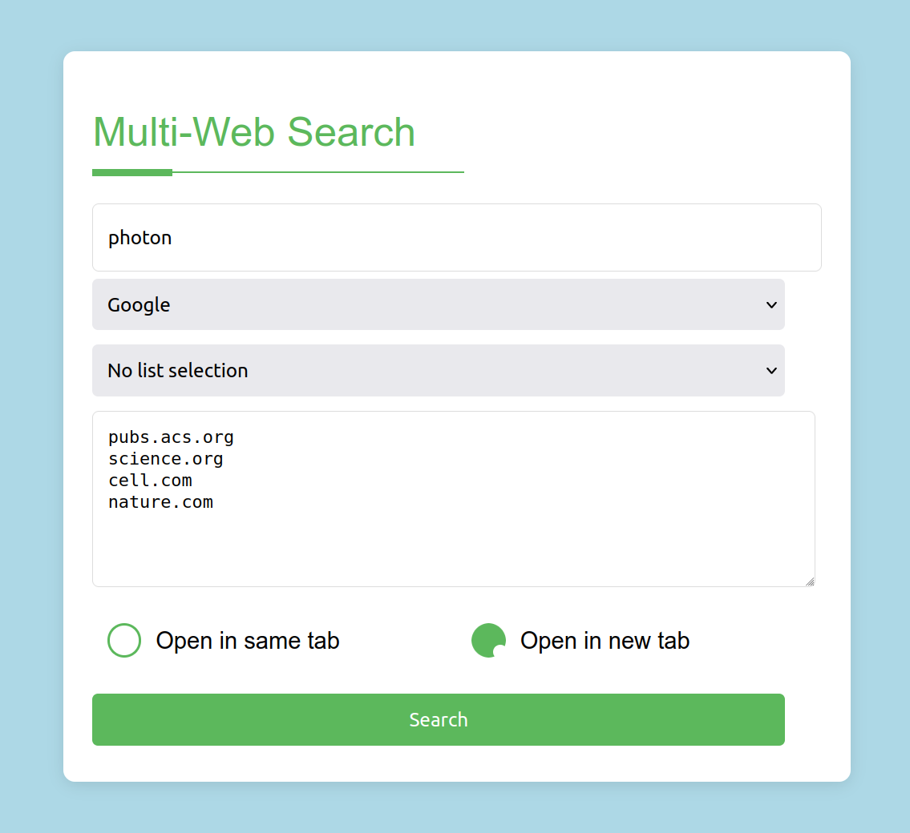

# Multi-Web Search

A web tool that makes it easy to search across a list of selected websites using a search engime.

 


## Installation

### Dependencies

This tool use `express` module. It is alredy provide when you clone, or download, the repository (*package-lock.json*, *package.json*, and enerithig how is the directory *node_modules*). So **normally you have nothing to install.**

But if you need to reinstall it you can do so using the command `npm install express`.

### 1. Download the repository

Simply download and extract `multiwebsearch.tar.gz` anywhere you want.

### 2. Start the server

Open a terminal, go to the path of *Multi-Web Search*, then start the server using [node](https://nodejs.org/).

```bash
cd path/to/multiwebsearch

node server.js
```

Normally you should see `Server is running on http://localhost:3000` in your terminal.


## Personalisation

### Changing the port

Edit `server.js` with a text editor, and change the value for `const PORT = 3000;` (should be at line 6) with the port you want.

### Manage search engine list

It can be done without any coding, simply by modifying a text file.

Edit the file `search_engime.txt` located in the `bin` directory. The format is simple first you have the name you want to display in the selection cell, then the adress of the search engime. 
Don't forget to write the query parameter (it is `search?q=` in the example) in the URL you provide. 
Example:

`"Google" https://www.google.com/search?q=`

To update, simply refresh the page.

### Create custom lists of website

It is possible to create custom list of website,so you don't have to rewrite them every time.

It can be done without any coding, simply by creating/deleting a text file.

Go to the directory `bin/websites_lists` the create a text file with the name you want to see in the selection cell (please avoid space in the name and use the underscore _).
Then simply copy paste the website you want to use: 1 URL by line.

Example:

In the file *bin/websites_lists/science.txt* this URL are are copied.

```
pubs.acs.org
science.org
cell.com
nature.com
```

To update, simply refresh the page. 

Then the selection choice named `science` will appear in the list selection box.

In case you want to remove a custom list, simply detele the text file.

Please note that it is not necessary to have create custom lits, the directory `bin/websites_lists` can be empty.
